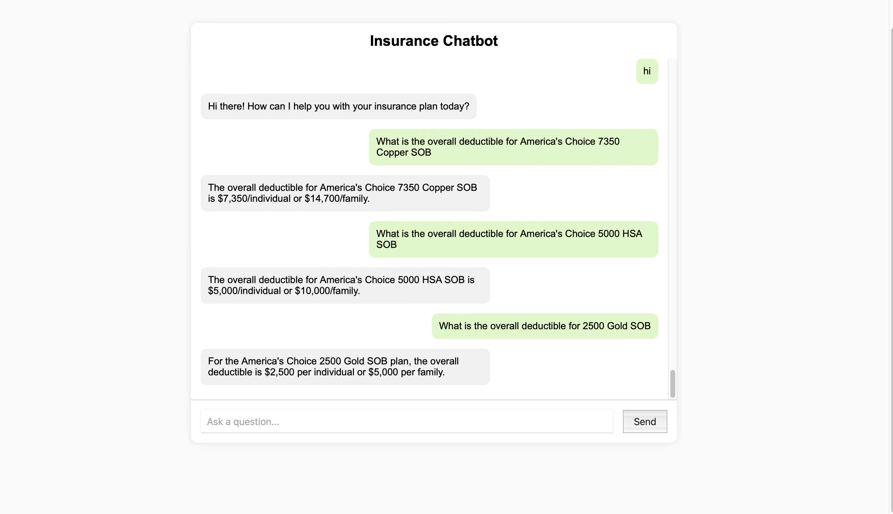

## InsuranceChatbot

A RAG-based chatbot system that extracts key information from insurance documents (PDFs, DOCs) and answers user questions using Gemini API.


## Setup

```bash
pip install -r requirements.txt
python -m uvicorn app.main:app --reload
```

## Environment Configuration

Create a `.env` file in the project root with the following content:

```
GEMINI_API_KEY=your_gemini_api_key_here
```

Replace `your_gemini_api_key_here` with your actual Gemini API key.

It is recommended to use the **Gemini 2.0 Flash** model for optimal performance in speed and context understanding.


## Start

open in browser
```bash
http://127.0.0.1:8000/
```


## Demo




## Summary

This chatbot currently supports accurate question answering based on the content of insurance PDFs and Word documents. It avoids hallucination, if the information is not found in the documents, the system returns "I don't know" instead of guessing.  


One of the intended RAG resources was a website link provided alongside the PDFs, but due to time constraints, this web-based source was not integrated into the system. If more time were available, the planned approach would be to leverage GPT-4's web browsing capabilities to process and extract relevant information from the dynamic site content.